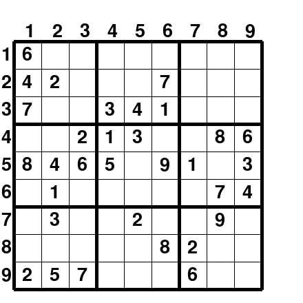
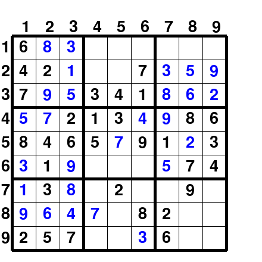

# Sudoku Solver

A playable Sudoku game in Python with a rule-based solver. You type moves in the terminal, and the board is drawn in a pygame window. The solver checks moves, lists the legal numbers for any cell, and fills in every cell that has only one possible answer, repeating until it is stuck or the puzzle is solved.

It also supports **diagonal Sudoku**, where both main diagonals must contain the numbers 1–9 as well.

| New board | After `solve-unique` |
|:---:|:---:|
|  |  |

Black numbers are the given cells, blue numbers were filled in during play, and cells in conflict with the rules are shown in red.

## How to run

You need Python 3.8 or newer.

```bash
git clone https://github.com/idoshalom1997/Sudoku-Solver.git
cd Sudoku-Solver
pip install -r requirements.txt
python play.py
```

Options:

```bash
python play.py --filled 35   # more given numbers = easier board (default 25)
python play.py --diag        # diagonal Sudoku
```

## How to play

Type a command in the terminal and the board window updates. Rows and columns are numbered 1–9.

| Command | What it does |
|---|---|
| `add <row> <col> <value>` | Place a number. It is rejected if it breaks a rule. |
| `remove <row> <col>` | Clear a cell. |
| `options <row> <col>` | Show the numbers that are still legal in that cell. |
| `solve-unique` | Fill every cell that has exactly one legal number, again and again. |
| `show-solution` | Show the full solution and end the game. |
| `done` | Quit. |

## How the solver works

All solver logic is in [`sudoku.py`](sudoku.py):

| Function | Purpose |
|---|---|
| `sudoku_options` | Legal numbers for a cell: removes everything already used in its row, column, 3×3 box (and diagonals in diagonal mode). |
| `sudoku_isvalid` | Checks that no filled cell breaks a rule. |
| `find_all_unique` | Lists empty cells that have exactly one legal number. |
| `find_all_conflicts` | Lists cells that have no legal number left, meaning an earlier move was wrong. |
| `add_square` | Places a number only if it is legal. |
| `fill_board` | Repeatedly fills single-option cells until the board is solved, stuck, or shown to be inconsistent. |

`fill_board` uses constraint propagation without guessing. Easy puzzles are solved completely, and harder ones are filled as far as logic alone allows.

## Tests

```bash
python -m unittest discover -s tests
```

## Project structure

```
sudoku.py          solver logic (my work)
sudoku_helper.py   board generator and pygame display, provided by the course staff
play.py            command-line launcher
tests/             unit tests for the solver
```

## Background

Written in December 2021 as an exercise in *Introduction to Programming* at the Hebrew University of Jerusalem (B.Sc. Statistics & Data Science). The course provided the board generator and display code; the solver in `sudoku.py` is my own.
